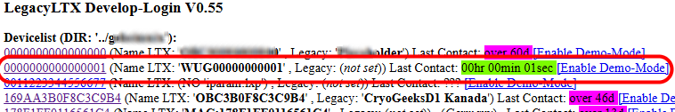

# Kurze Übersicht zu „LTX“

„LTX“ („LTX-Server“ und „LTX-Legacy“) steht für zwei Sammlungen von Scripten, mit denen die dazu gehörigen Datenlogger mit dem Internet kommunizieren können.

„LTX-Server“ verwendet eine SQL-Datenbank, „LTX-Legacy“ ist eine rein dateibasierte Lösung und eine Teilmenge des „LTX-Servers“.

Datenlogger übertragen oft nur in geringem Raster (z.B. alle paar Stunden), pro Übertragung können aber viele Messungen enthalten sein. Das alles muss möglichst zuverlässig und schnell laufen: zum Beispiel müssen fehlerhafte Übertragungen wiederholt und Fehler erkannt werden (wie etwa leere Batterien, eindringende Feuchtigkeit, Verbindungsabbrüche). Auch müssen Datenlogger beispielsweise Kommandos oder Updates vom Server erhalten können. Oft müssen auch eine größere Anzahl von Geräten und unterschiedliche Berechtigungen verwaltet werden.

Dazu wurden „LTX“ entwickelt. Primär liegt dessen Schwerpunkt nicht auf Langzeitspeicherung von Daten, sondern als schnelles und flexibles Eingangsportal (sozusagen der „Rote Teppich“ zur Cloud).

„LTX“ ist komplett quelloffen, wartungsarm (es ist so konzipiert, dass es sich selbst pflegt) und kann auch (nahezu) jedem minimalen LAMP-Server installiert werden. Es benötigt lediglich einen Webserver mit PHP und für die Variante „LTX-Server“ eine kleine SQL-Datenbank.

Da „LTX“ Daten nur temporär speichern muss (Hinweis: in den Dokus als „quota“ bezeichnet), können so auch mit einer kleinen Datenbank sehr viele Geräte verwaltet werden. Um Energie zu sparen, verwendet „LTX“ asynchrone Scripte. Datenlogger werden so durch eventuell langsame Antwortzeiten der dahinter liegenden Systeme (etwa Datenbank oder Transfers) nicht aufgehalten. Gleichzeit lassen sich so „LTX-Server“ und „LTX-Legacy“ gut entkoppeln („LTX-Legacy“ liegt sozusagen einfach vor dem „LTX-Server“).

Üblicherweise übertragen die Datenlogger per mobilem Internet (2G, 4G, LTE-M/-NB) oder auch über nicht-terrestrische Netze.

Gelegentlich besteht der Wunsch nach zusätzlichen Daten, wie etwa Wetterdaten oder Messwerte von Sensoren ohne Speicher oder Gateways mit aufzunehmen. Auch das ist mit „LTX“ problemlos möglich. 

# Upload mit GET-URL

Beispielsweise einfache Wetterstationen verwenden oft ein ziemlich einfaches System, um Daten weiterzugeben, indem die Messwerte via URL übergeben werden, diese werden dann einfach in eine HTTP-Anfrage mit URL-Parametern gepackt. 

Das Ganze könnte dann z.B. für eine Wetterstation so aussehen (in einer Zeile)

```text
http://server.abc/script.php?ID=0011223344556677&PASSWORD=SECRET&temp=25.9&humidity=61.72
```

Der Block „`ID=0011223344556677&PASSWORD=SECRET&temp=25.9&humidity=61.72`“ enthält die Zugangsdaten (ID und PASSWORD) und Messwerte. (‚temp‘ und ‚humidity‘).

Im einfachsten Fall und weil beispielsweise die Daten häufig übertragen werden, wird nicht einmal die Antwort des Servers ausgewertet. 

Für Upload mit GET-URL enthält „LTX“ das Script „.../lxu_wug_v1.php“. 

## Beispiel: EcoWitt WS90 mit Wunderground-Protokoll

Sehr viele andere Hersteller bieten GET-URL und nahezu identische Protokolle an. Inoffiziell ist eine andere Bezeichnung dafür „Wunderground“-Protokoll, einen offiziell definierten Standard aber dafür scheint es nicht zu geben. Es ist aber sehr leicht möglich, jederzeit eigene Sensoren in „lxu_wug_v1.php“ einzupflegen. Die aktuell implementierten Kennungen finden sich im Anhang.

Die EcoWitt WS90 ist eine günstige und kompakte Wetterstation und misst alle wichtigen Parameter. Sie enthält keine mechanischen Teile (Windparameter werden per Ultraschall gemessen, Niederschlag über einen Piezo-Sensor). Sie wird solar versorgt und ist drahtlos. Die Messwerte werden alle paar Sekunden per Funk (868 MHz oder 915 MHz) gesendet und können z.B. von einem Display und/oder einem Gateway aufgegriffen werden. Sowohl Display, als auch Gateway verfügen über WiFi und können mit einer APP parametriert werden.

Damit ist es auch möglich, die Daten an einen Server weiterzuleiten. Als Format bietet sich  GET-URL (Einstellung „Protokoll wie ‚Wunderground‘“) an. 

Aus dem Header von „lxu_wug_v1.php“:   

```c
/* lxu_wug_v1.php - Script fuer Wunderground-aehnliche Daten per GET-URL
 * ------------------------------------------------------
 * Beispiel:
 * server.abc/ltx/sw/lxu_wug_v1.php?ID=0011223344556677&PASSWORD=XXXXX&tempf=61.70
 *
 * Setup fuer EcoWitt in EcoWitt-APP:
 * - Wetterdienst auswaehlen
 * - Protokoll: Wunderground
 * - Server/IP(http:) Hostname, z.B. 'server.abc' oder IP
 * - Pfad: inkl. '/' und '?', z.B.: '/ltx/sw/lxu_wug_v1.php?'
 * - ID: eine beliebige 16-stellige HEX-Zahl, z.B. '0123456789ABCDEF'
 * - Key: 'D_API_KEY' aus Datei './conf/api_key.inc.php'; kann auch dynamisch pro Geraet sein, siehe './conf/check_dapikey.inc.php'
 * - Port: i.d.R. 80
 * - Upload-Intervall: z.B. 1 Minute
 * ------------------------------------------------------ */
```

Das wars auch schon. Beim ersten Upload erzeugt „LTX“ automatisch daraus eine Konfigurationsdatei. Diese nennt sich ‚iparam.lxp‘ und steuert auf Datenloggern die Messwerterfassung. Hier aber steuert sie nur die Art, wie Messwerte in „LTX“ importiert werden. Als Gerätetyp wird 950 definiert (eine interne Zuordnung. Geräte mit Typ <= 999 verfügen über keinen Speicher, sind also Sensoren oder Gateways oder - wie hier - eine Wetterstation). Die Typen darüber sind „echte“ Datenlogger.

Es ist auch möglich einzelne Kanäle nicht zu importieren, Alarme zu prüfen und Messwerte zu linearisieren. Doch erst einmal sind die Daten auf dem Server.

Wie erwähnt, besteht „LTX“ aus 2 Schichten:

- Legacy (immer enthalten). Dies ist ein überwiegend textbasiertes Interface für Administrator-Anwendungen. Das automatisch erzeugte Gerät ist rot markiert:


- Server mit GUI und SQL. Dieses Interface ist für Anwender vorgesehen.

Die Zugangsdaten für die GUI werden im Legacy-Bereich erzeugt ( „.../ltx/legacy/index.html“). Dort ist das Gerät auch bereits aufgelistet. 

Einige Einstellungen (z.B. die „quota“ oder auf welche Weise Daten weiter „gepusht“ werden, können nur im Legacy-Bereich eingestellt werden).

Mit „Generate Key Badge“ wird ein „Device Owner Token“ erzeugt:

Damit kann es über den „Server Login“ (auf dem der „LTX-Server“ läuft) angesprochen werden. 

Über das „Device Owner Token“ können die Daten auch für andere Anwender oder auch zum externen Datenabruf freigegeben werden, siehe separate Doku zum „LTX“.

„LTX“ bietet außer einem einfachen Graphen keine besonderen Darstellungsmöglichkeiten an, primär wichtig ist es, die Daten auf dem Server verfügbar zu haben, die genaue Auswertung kann später auf dem Zielsystem erfolgen.

## Ausnahmezustände

Normalerweise geht „lxu_wug_v1.php“ davon aus, dass sämtliche in der Konfigurationsdatei „iparam.lxp“ enthaltenen Parameter geliefert werden. Mehrere Problemzustände sind aber denkbar. In diesen Fällen passiert das Folgende:

- Es werden nur ein Teil der Parameter geliefert: Anscheinend neigt z.B. die EcoWitt-Station dazu, bei Übertragungsproblemen einzelne Parameter einfach wegzulassen. In diesem Fall setzt das Script die Werte auf den Fehlercode „ErrNoValue“.

- Parameter sind ungültig: Beispielsweise kann es vorkommen, dass für einen fehlenden Wert einfach ein unrealistischer Wert als Fehlercode geliefert wird (z.B. -999°C für einen Temperatursensor).

## Links

Github „LTX-Server“: [https://github.com/joembedded/LTX_server](https://github.com/joembedded/LTX_server)

GitHub „OSX-Sensoren und Gateways“: [https://joembedded.de/x3/ltx_firmware/index.php?dir=./Open-SDI12-Blue-Sensors](https://joembedded.de/x3/ltx_firmware/index.php?dir=./Open-SDI12-Blue-Sensors)

## Liste der definierten GET-Parameter

In „lxu_wug_v1.php“ werden die Parameter als JSON definiert. Jeder Parameter wird einem Index zugeordnet, beispielsweise für die 4 Feuchte im Innenraum. Die Konfigurationsdatei ‚iparam.lxp‘ kann sich so nur die Daten mit den gewünschten Indizes holen. Zusätzliche Parameter können im Script leicht ergänzt werden.

Manche Parameter können mehrfach vorkommen, z.B. bei Temperaturen. Weitere bekommen einfach eine Nummer angehängt. Beispielsweise „soiltemp, soiltemp1, soiltemp2, ..“. 

Bei Unklarheiten oder zusätzlichen Sensoren gibt es einen „Debug“-Modus (einstellbar im „Legacy“), dann werden sämtliche GET-Parameter in die Datei „.../dbg/indata.log“ mitgeschrieben.

Auch kommen manche Messwerte in ungewöhnlichen Einheiten, wie etwa die Temperaturen, die bei „Wunderground“ wohl meist in „°F“ statt „°C“ sind. Auch diese werden automatisch umgewandelt.

### Liste der GET-Parameter für die initiale Version des Scripts

```json
{ 
  "tempf": {
    "six": 0,
    "unit": "°C_Outdoor",
    "offset": 32.0,
    "multi": 0.555555555556,
    "digits": 3,
    "rem": "Outdoor Temp (raw: in °F)"
  },
  "humidity": {
    "six": 1,
    "unit": "%rH_Outdoor",
    "offset": 0.0,
    "multi": 1.0,
    "digits": 2,
    "rem": "Outdoor Humidity in %"
  },
  "dewptf": {
    "six": 2,
    "unit": "°C_DewOutdoor",
    "offset": 32.0,
    "multi": 0.555555555556,
    "digits": 3,
    "rem": "Dewpoint (raw: in °F)"
  },
  "indoortempf": {
    "six": 3,
    "unit": "°C_Indoor",
    "offset": 32.0,
    "multi": 0.555555555556,
    "digits": 3,
    "rem": "Indoor Temp (raw: in °F)"
  },
  "indoorhumidity": {
    "six": 4,
    "unit": "%rH_Indoor",
    "offset": 0.0,
    "multi": 1.0,
    "digits": 2,
    "rem": "Outdoor Humidity in %"
  },
  "baromin": {
    "six": 5,
    "unit": "mBar_Baro",
    "offset": 0.0,
    "multi": 33.8637526,
    "digits": 1,
    "rem": "Baro (raw in inch)"
  },
  "solarradiation": {
    "six": 6,
    "unit": "W/m²_Solar",
    "offset": 0.0,
    "multi": 1.0,
    "digits": 3,
    "rem": "Solar Radiation"
  },
  "UV": {
    "six": 7,
    "unit": "UV",
    "offset": 0.0,
    "multi": 1.0,
    "digits": 1,
    "rem": "UV-Index"
  },
  "winddir": {
    "six": 8,
    "unit": "°Dir_Wi",
    "offset": 0.0,
    "multi": 1.0,
    "digits": 0,
    "rem": "0-360°"
  },
  "windspeedmph": {
    "six": 9,
    "unit": "m/sec_Wi",
    "offset": 0.0,
    "multi": 0.44704,
    "digits": 1,
    "rem": "WindSpeed"
  },
  "windgustmph": {
    "six": 10,
    "unit": "m/sec_WiMax",
    "offset": 0.0,
    "multi": 0.44704,
    "digits": 1,
    "rem": "Boe"
  },
  "rainin": {
    "six": 11,
    "unit": "mm/hr_Rain",
    "offset": 0.0,
    "multi": 25.4,
    "digits": 2,
    "rem": "Rain per last hr (raw: inch/hr)"
  },
  "dailyrainin": {
    "six": 12,
    "unit": "mm/d_Rain",
    "offset": 0.0,
    "multi": 25.4,
    "digits": 2,
    "rem": "Daily rain (raw: inch/d)"
  },
  "soiltempf": {
    "six": 13,
    "unit": "°C_Soil",
    "offset": 32.0,
    "multi": 0.555555555556,
    "digits": 3,
    "rem": "Soil Temp (raw: in °F)"
  },
  "soilmoisture": {
    "six": 14,
    "unit": "%Vol_Soil",
    "offset": 0.0,
    "multi": 1.0,
    "digits": 0,
    "rem": "Soil Moisture (Vol%)"
  }
}
```
