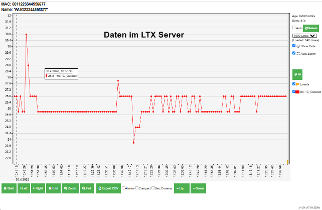
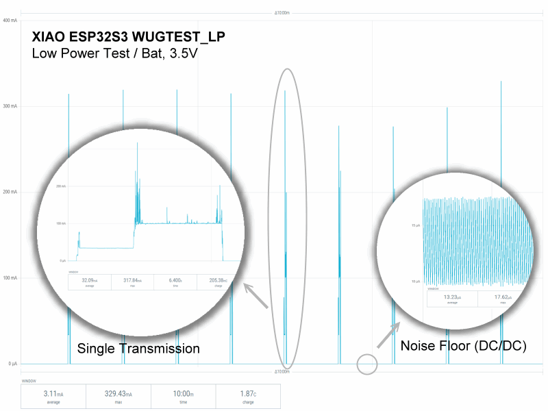

# WugTest - (C)JoEmbedded

**Stand:** 30.04.2026

Arduino-Sketch für einen Uploader auf [LTX_SERVER](https://github.com/joembedded/LTX_server) via GET-UPLOAD über einen XIAO ESP32S3.



Die Sketches verbinden sich mit WLAN und senden in einem per Makro einstellbaren Intervall einen ungefähren Temperaturwert an einen LTX/Wunderground-kompatiblen Upload-Endpunkt.

Neben der normalen Dauerlauf-Version unter `wugtest/` gibt es mit `wugtest_lp/` eine Low-Power-Version. Sie wacht nur zum Upload auf, verbindet sich dann mit dem WLAN, überträgt Temperatur, RSSI und einen Deep-Sleep-Eventzähler und meldet sich danach wieder vom WLAN ab, bevor der ESP32 in Deep-Sleep geht.

## Energieverbrauch Low Power

`wugtest_lp.ino` schickt alle 60 Sekunden einen Messwert an den Server. Über Standard USB versorgt kann der XIAO ESP32S3 eine 3.6V Batterie laden oder man kann über 2 Lötpads ('Bat+', 'Bat-') das Modul mit 3.3V - 3.7V versorgen.

> [!IMPORTANT]
> Bei Versorgung über 5V (USB) ist der Ruhestrom im Deep-Sleep ca. 150µA - 500µA, bei Versorgung über 'Bat+', 'Bat-' lediglich ca. 15µA.

Für den durchschnittlichen Stromverbrauch ist hauptsächlich die kurze Wachphase verantwortlich.



> [!NOTE]
> Das häufige An-/Ab-melden vom WiFi ist 'eigentlich' kein Good-Practice, aber bei einzelnen wenigen Sensoren soweit OK.

## Die beiden Sketche

In beiden Sketch-Ordnern ist die jeweilige `NAME.ino` nur der Arduino-Einstieg mit `setup()` und `loop()`. Die eigentliche Logik liegt in `app.cpp`/`app.h`, damit Formatierung und "Gehe zu Definition/Deklaration" wie bei normalen C++-Dateien funktionieren.

Die Doku [docu/0950_get_upload_DE.md](docu/0950_get_upload_DE.md) beschreibt das GET-Upload-Format:

```text
http://server.example/ltx/sw/lxu_wug_v1.php?ID=0000000000000000&PASSWORD=CHANGE_ME&tempf=61.70
```

`ID` und `PASSWORD` sind Zugangsdaten. Der Temperaturwert wird als Fahrenheit-Wert im Parameter `tempf` übertragen.

Die Low-Power-Version hängt zusätzlich `rssi` und `event` an die URL an:

```text
http://server.example/ltx/sw/lxu_wug_v1.php?ID=0000000000000000&PASSWORD=CHANGE_ME&tempf=61.70&rssi=-67&event=42
```

Der Eventzähler liegt im RTC-RAM des ESP32 und bleibt über Deep-Sleep-Zyklen erhalten. Bei Reset oder Spannungsverlust startet er wieder neu.

## Dateien

- [wugtest/wugtest.ino](wugtest/wugtest.ino): Einstieg für die Dauerlauf-Version.
- [wugtest/app.cpp](wugtest/app.cpp): Logik für WLAN-Verbindung und HTTP-GET-Upload.
- [wugtest_lp/wugtest_lp.ino](wugtest_lp/wugtest_lp.ino): Einstieg für die Low-Power-Version.
- [wugtest_lp/app.cpp](wugtest_lp/app.cpp): Logik für Deep-Sleep, WLAN-Upload, RSSI und Eventzähler.
- [secret/_placeholder_config.h](secret/_placeholder_config.h): Vorlage mit ungefährlichen Beispielwerten.
- `secret/config.h`: lokale private Konfiguration mit WLAN- und Upload-Zugangsdaten.
- [docu/0950_get_upload_DE.md](docu/0950_get_upload_DE.md): Dokumentation zum GET-Upload.

## Konfiguration

Vor dem Kompilieren muss eine lokale Konfiguration existieren:

```text
secret/config.h
```

Als Startpunkt kann [secret/_placeholder_config.h](secret/_placeholder_config.h) verwendet werden.

Wichtige Makros:

```cpp
#define WIFI_SSID "YourWifiName"
#define WIFI_PASSWORD "YourWifiPassword"
#define LTX_ENDPOINT "http://example.org/ltx/sw/lxu_wug_v1.php"
#define LTX_DEVICE_ID "0000000000000000"
#define LTX_DEVICE_PASSWORD "CHANGE_ME"
```

## Installation und Schnellstart

- Verzeichnis auf Platte anlegen und dieses Repo darin abspeichern

- `Arduino IDE` installieren (Version 2.3.8 oder neuer)
  
  Die Arduino IDE ist OK für erste Tests und man kann mit ihr wunderbar testen
  und auch die .ino-Dateien hier öffnen. Man muss aber das Board ('XIAO_ESP32S3'), evtl. PSRAM und COM noch auswählen. Auch ist ratsam, in den `Preferences` den XIAO Board Manager auszuwählen:

```powershell
https://raw.githubusercontent.com/espressif/arduino-esp32/gh-pages/package_esp32_index.json
```

- In laufender Entwicklung ist es aber oft einfacher, eine externe Schnittstelle (hier `Serial1`) zu verwenden anstelle der internen `Serial` (USB), und via Kommandozeile zu kompilieren:

## Arduino CLI

Der Sketch kann mit `arduino-cli` für den XIAO ESP32S3 kompiliert und
hochgeladen werden. Die passende Board-ID ist:

```text
esp32:esp32:XIAO_ESP32S3
```

Die Dauerlauf-Version ist ein eigener Sketch-Ordner (`wugtest\wugtest.ino`). 

> [!TIP]
> Bei Arbeiten direkt im Verzeichnis kann der Name weggelassen werden, da nur ein
.ino pro Verzeichnis möglich ist. 

```powershell
cd C:\c\arduino\wugtest
arduino-cli compile --fqbn esp32:esp32:XIAO_ESP32S3 .\wugtest
```

Kompilieren und direkt auf das Board hochladen, hier beispielhaft auf `COM33`:

```powershell
arduino-cli compile --fqbn esp32:esp32:XIAO_ESP32S3 --port COM33 --upload .\wugtest
```

Den aktuellen Port zeigt:

```powershell
arduino-cli board list
```

Wenn die erzeugten Binärdateien im Sketch-Verzeichnis abgelegt werden sollen:

```powershell
arduino-cli compile --fqbn esp32:esp32:XIAO_ESP32S3 --export-binaries .\wugtest
```

Die Low-Power-Version liegt ebenfalls in einem eigenen Sketch-Ordner:

```powershell
arduino-cli compile --fqbn esp32:esp32:XIAO_ESP32S3 .\wugtest_lp
```

Upload der Low-Power-Version:

```powershell
arduino-cli compile --fqbn esp32:esp32:XIAO_ESP32S3 --port COM33 --upload .\wugtest_lp
```

Falls der Upload nicht startet, den XIAO ESP32S3 in den Bootloader-Modus
bringen: `BOOT` gedrückt halten, kurz `RESET` drücken, dann `BOOT` loslassen
und den Upload erneut starten.
